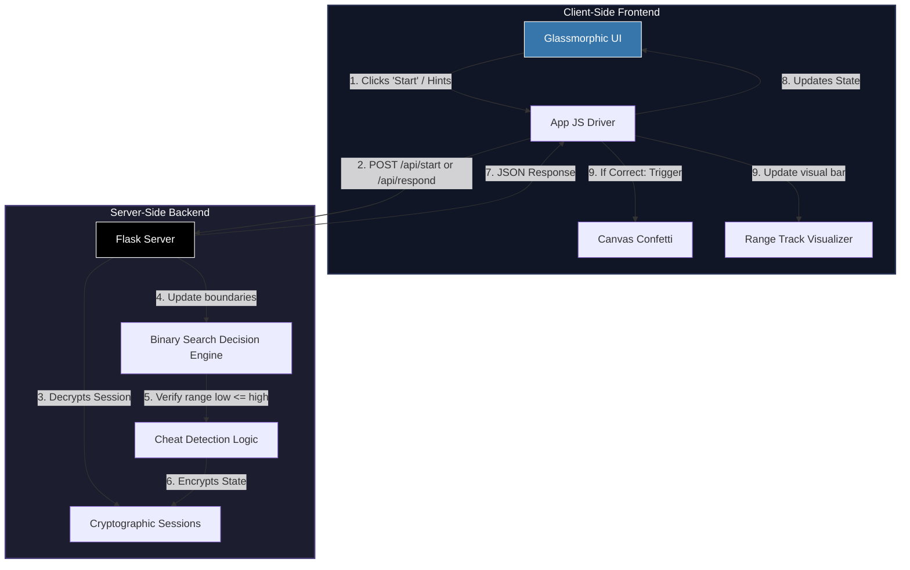

# Number Prediction Game (AI Guessing)

A premium, interactive web-based mind-reading game where the computer guesses the user's secret number. Built with a robust **Python Flask** backend and a modern, high-fidelity **glassmorphic** frontend.

    

---

## 📖 Table of Contents
- [Features](#-features)
- [How It Works](#-how-it-works)
- [System Architecture](#-system-architecture)
- [Directory Structure](#-directory-structure)
- [Getting Started](#-getting-started)
- [License](#-license)

---

## ✨ Features

- **🎮 Immersive Glassmorphic UI**: Vibrant gradient background glow spheres, translucent frosted panels (`backdrop-filter`), smooth view transitions, and custom typography (`Outfit`).
- **🧠 Optimal Decision Logic**: Employs a stateful binary search algorithm that guarantees prediction of any number in **7 attempts or fewer**.
- **🚫 Contradiction / Anti-Cheat Detection**: Validates inputs in real-time. If user answers contain logical contradictions (e.g. saying the number is higher than 60 and lower than 59), the AI will flag the error and display a warning.
- **📊 Dynamic Progress Visualizer**: A visual range slider shows the remaining search space shrinking dynamically with each guess.
- **🎉 Interactive Celebrations**: Integrates a lightweight canvas-based particle confetti system upon successful prediction.

---

## 🧮 How It Works

The AI implements a classic **Binary Search Algorithm** to find the user's target number.

1. **Initialization**: The search boundaries are set to $low = 1$ and $high = 100$.
2. **Guessing Formula**: The AI computes the midpoint of the current range:
   $$\text{Guess} = \left\lfloor \frac{low + high}{2} \right\rfloor$$
3. **Response Adjustments**:
   - If the secret number is **higher**, the lower boundary is adjusted: $low = \text{Guess} + 1$.
   - If the secret number is **lower**, the upper boundary is adjusted: $high = \text{Guess} - 1$.
4. **Time Complexity**: The search space is halved after every iteration. Thus, the maximum number of attempts is:
   $$\lceil \log_2(100) \rceil = 7 \text{ attempts}$$

---

## 🏗️ System Architecture

The application implements a stateless client calling stateful backend endpoints using Flask's secure session cookies:



---

## 📝 Directory Structure

```text
Number Prediction Game (AI Guessing)/
│
├── app.py                  # Python Flask backend server (routes & API logic)
├── README.md               # Documentation & setup instructions
│
├── templates/
│   └── index.html          # Main HTML structure
│
└── static/
    ├── style.css           # Vanilla CSS layout, glassmorphic themes & keyframe animations
    └── app.js              # Frontend controller, API integration & confetti particle simulation
```

---

## 🚀 Getting Started

Follow these steps to run the game locally:

### Prerequisites
Make sure you have **Python 3** installed.

### Installation
1. Clone or copy the project files to your local machine.
2. Open a terminal inside the project directory and install Flask:
   ```bash
   pip install flask
   ```

### Running the App
1. Start the Flask local server:
   ```bash
   python app.py
   ```
2. Open your web browser and navigate to:
   ```
   http://127.0.0.1:5000
   ```

---

Made with ❤️ by [Dhanish Ladwani](https://github.com/dhanish0711/)
